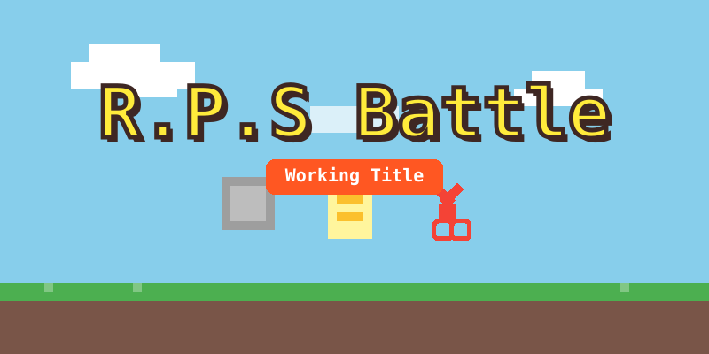

# ⚔️ RPS Battle (가위바위보 배틀)

**심리전과 도파민을 자극하는 고품격 가위바위보 대결 게임.**



## 📌 개요

**RPS Battle**은 고전적인 가위바위보 게임을 현대적인 실시간 멀티플레이어로 재해석한 프로젝트입니다. 단순한 운빨 게임을 넘어 경쟁적인 요소와 시각적인 피드백을 강화하여 사용자 몰입도를 높였습니다.

*   **3판 2선승제 (Best of 3)**: 먼저 2승을 거두는 사람이 최종 승리합니다.
*   **하트 시스템 (Heart System)**: 패배 시 하트가 차감되며, 시간이 지나면 회복되는 스태미나 시스템입니다.
*   **랭킹 시스템 (Ranking)**: ELO 기반의 실력 척도 시스템 (예정).
*   **다국어 지원 (i18n)**: 영어 및 한국어를 완벽 지원합니다.

## 🛠 기술 스택 (Tech Stack)

### 프론트엔드 (`rps.client`)
*   **프레임워크**: [Next.js 14+](https://nextjs.org/) (App Router)
*   **언어**: TypeScript
*   **스타일링**: [Tailwind CSS](https://tailwindcss.com/)
*   **상태관리/통신**: React Context + Socket.io Client
*   **다국어**: `react-i18next`

### 백엔드 (`rps.server`)
*   **런타임**: Node.js
*   **프레임워크**: Express.js
*   **실시간 통신**: [Socket.io](https://socket.io/)
*   **데이터베이스**: MongoDB (Mongoose)

## ✨ 주요 기능

*   **실시간 멀티플레이**: 지연 없는 빠른 매칭과 게임 플레이.
*   **매칭 시스템**:
    *   **일반 모드 (Normal)**: 가볍게 즐기는 모드.
    *   **랭크 모드 (Rank)**: ELO 점수를 걸고 싸우는 경쟁 모드.
*   **탄탄한 게임 루프**:
    *   타이머 기반 라운드 진행.
    *   연결 끊김 시 자동 기권승 처리.
    *   무승부 처리 (승부가 날 때까지 무한 재대결).
*   **유저 성장 시스템**:
    *   **하트**: 최대 5개 보유 가능, 패배 시 -1, 10분마다 +1 자동 충전.
    *   **전적**: 승/패 기록 저장.
*   **현지화 (Localization)**:
    *   언어권에 따른 가위바위보 순서 변경 (예: 한국어는 가위 -> 바위 -> 보 순서).
    *   모든 UI 텍스트 번역 지원.

## 🚀 시작하기 (Getting Started)

### 요구 사항
*   Node.js (v18 이상)
*   npm 또는 yarn
*   MongoDB 인스턴스 (로컬 또는 Atlas) - *DB 없이 UI 테스트만 하려면 선택 사항이지만, 로그인/전적 저장을 위해서는 필수입니다.*

### 설치 방법

1.  **저장소 클론:**
    ```bash
    git clone https://github.com/papask/RPS_battle.git
    cd RPS_battle
    ```

2.  **패키지 설치 (루트에서):**
    ```bash
    npm install
    ```
    *(참고: 워크스페이스 설정이 안 되어 있다면 각 폴더에서 따로 설치해야 할 수도 있습니다)*

    ```bash
    cd rps.server && npm install
    cd ../rps.client && npm install
    ```

## 🏃‍♂️ 프로젝트 실행

**백엔드**와 **프론트엔드** 서버를 모두 실행해야 합니다.

### 1. 백엔드 서버 실행
```bash
cd rps.server
npm run dev
# 서버는 http://localhost:3001 에서 실행됩니다.
```

### 2. 프론트엔드 클라이언트 실행
```bash
cd rps.client
npm run dev
# 클라이언트는 http://localhost:3000 에서 실행됩니다.
```

## 🧪 테스트 방법

1.  **두 개의 브라우저 탭**에서 [http://localhost:3000](http://localhost:3000)을 엽니다.
2.  각 탭에서 닉네임을 입력합니다.
3.  양쪽 탭에서 **"매칭 찾기 (Find Match)"** 버튼을 클릭합니다.
4.  시스템이 자동으로 매칭을 성사시키고 게임이 시작됩니다!

## 📂 프로젝트 구조

```
RPS_battle/
├── rps.client/         # Next.js 프론트엔드
│   ├── src/app/        # App Router 페이지
│   ├── src/components/ # UI 컴포넌트
│   └── src/locales/    # 다국어 JSON 파일
├── rps.server/         # Express 백엔드
│   ├── src/managers/   # 게임 로직 (방 관리, 매칭)
│   ├── src/models/     # Mongoose 모델
│   └── src/index.ts    # 진입점
└── README.md           # 본 파일
```

## 🗺 로드맵 (Roadmap)

- [x] MVP (기본 게임 루프, 소켓 통신)
- [x] Phase 2: 게임 엔진 (3판 2선승, 하트, 전적)
- [ ] **Phase 3: 데이터 & 랭킹** (ELO 시스템, 하드코어 연승)
- [ ] **Phase 4: 폴리싱** (애니메이션, 사운드)
- [ ] **Phase 5: 런칭** (소셜 로그인, 배포)

---

Developed by **Papask** (or Project Team)
